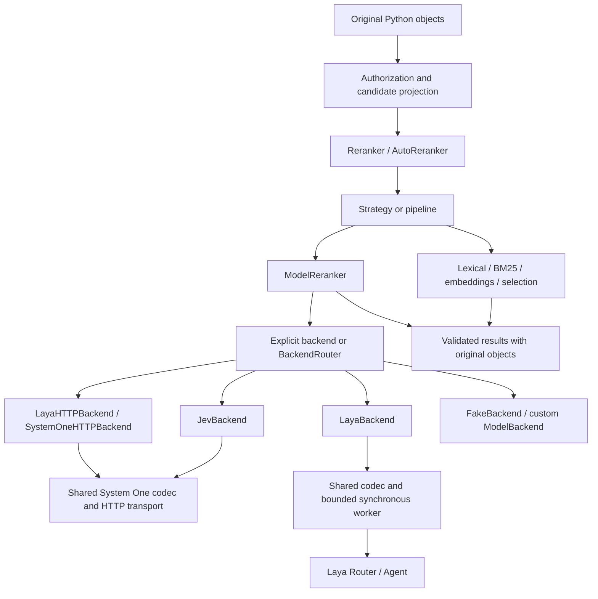

# TypedRank architecture

Design reference for the Step 2 TypedRank baseline and later backend-neutral phases. Reviewed 2026-09-23.

The new repository and distribution are named `typedrank`, with the Python import `typedrank`. This repository was created separately; the original `jev-rankkit` checkout remains unchanged. Read [MIGRATION_PLAN.md](MIGRATION_PLAN.md) for the file inventory, sequencing, and acceptance gates.

## 1. Decision

Preserve the object-preserving, dependency-free ranking core of `jev-rankkit`. Make model execution a backend concern, with explicit Jev, local Laya, Laya HTTP, and custom implementations. Keep embedding backends separate. Rename the generic pipeline stage **ModelReranker**: it describes what the stage does and agrees with `ModelBackend`.

Keep three independent decisions:

- **Strategy:** how to rank, such as pointwise, shared-context listwise, lexical, or a cascade.
- **Backend:** where a model stage runs, such as Jev, local Laya, or a self-hosted server.
- **Checkpoint:** which model within a backend runs, such as Laya English or multilingual.

`AutoStrategy` chooses strategy and pruning. `BackendRouter` selects an eligible backend for a model stage. Laya's own `Router` selects a checkpoint within Laya. A choice at one layer must not silently change another layer's contract.



## 2. Evidence and scope of inspection

The local source checkout is `C:/Users/kashy/OneDrive/Desktop/mywork/jev-projects`, with remote `kashyaprparmar/jev-rankkit`. Its clean HEAD and remote HEAD both resolved to **e027d12e210f25265c8239ac4237d8d6a779427c**. Inspected the backend contracts and Jev adapter, facade, auto planner, pipeline, executor, candidate preparation, prompts, metrics, selection, cache, result types, evaluation, embedding adapter, tests, packaging, examples, and CI. [J-source]

Laya source was inspected in a separate research checkout at **010bacef009c855ccba814b51f7c8e1d38ab5e3f**, reporting version **0.3.7**. Inspection included `Router`, `Agent`, sequence construction, language detection, shortlisting, HTTP serving, relevant tests, and package metadata. The published PyPI 0.3.7 wheel was downloaded for static inspection only; its nine `laya/*.py` modules match this source after line-ending normalization. Wheel SHA-256: `370beee36a6962f0daed3f086146b7dc6cc825fee0a1941ec05ea7207989ea8a`. This rules out designing against an unpublished Router or server API. [L-source] [L-package]

No model weights were downloaded, no billable Jev requests were made, and no model inference or comparative performance benchmark was run. Compatibility observations below are source findings; quality, calibration, and throughput remain implementation-time measurements. Proposed TypedRank APIs are designs, not existing APIs.

### Existing code worth retaining

The source already preserves object identity and duplicate occurrences, separates caller IDs from transport IDs, validates normalized utility scores, uses immutable public records, bounds concurrent work, reserves budgets before dispatch, validates cached results, and records coverage and approximation. Listwise ranking deliberately rejects independently scored chunks. Pipelines preserve survivors and previous-stage checkpoints. These are useful invariants, not reasons to rebuild the engine. [J-candidates] [J-runtime] [J-pipeline]

Backend neutrality is incomplete in specific places: the facade constructs only `typesafe:` models; `JevReranker` is actually generic; automatic offline routing bans every model; cost estimation reads token-price attributes; and the executor labels every model score a `noul_probability`. The migration plan identifies all concrete source occurrences and dependent examples/tests. [J-api] [J-auto] [J-runtime]

### Verified Laya behavior

- `Router(models=None, device=None, token=None, max_loaded=2, default="english", auto_task_detection=False, standalone_repos=False, preload=False, lang_guess=None)` is synchronous. `route(...)` decides without loading; `predict(state, questions, model=None, task=None, lang=None, lang_guess=None)` loads and runs the selected Agent. `system_one` aliases `predict`. [L-router]
- Default checkpoint locations are the root of `convaiinnovations/laya`, its `multilingual` subfolder, and its `typed-decisions` subfolder. Separate repositories are supported by `standalone_repos=True`. `model=` on Router accepts checkpoint names/aliases, not arbitrary Hub repository names; custom locations belong in `models`, or in `Agent(model_id_or_path, device, token, subfolder)`. [L-router] [L-agent]
- Routing precedence is explicit model, explicit task, opt-in workflow detection, explicit language, caller language hint, heuristic language/script detection, then default. Typed-decisions is not a generic automatic default. Multilingual support is advertised as 100+ languages; this does not establish equal reranking quality across languages. [L-router]
- `Router.load`, `attach`, `preload`, `unload`, and `loaded` are available. LRU defaults to two resident checkpoints. Preload raises the residency cap to include already resident and requested checkpoints; `preload=True` means all three in stock Laya. Lifecycle uses an `RLock`, but inference runs outside that lock. [L-router]
- `Agent.system_one` and its `predict` alias return `model`, `answers`, and `usage`. Router adds `routing`. The top-level model string is `laya-rl-agent`, not an immutable checkpoint revision. Noul relevance is `answers[id].noul`; its confidence is certainty in either binary answer, not probability of relevance. Score is an expected ordinal index; choice is a label with a distribution. [L-agent]
- Stock sequence construction truncates instruction heads, criterion descriptions, and state. Defaults in code are `max_len=512`, `head_max_len=192`, overridden by checkpoint configuration. The documented checkpoint context lengths are 512 for English and 1024 for multilingual/typed-decisions, not unlimited input. One sequence is built per question and questions are collated for inference. Total processed tokens and the longest sequence are different quantities. [L-sequence] [L-agent]
- Agent can fall back to CPU at initialization and during GPU failures, mutating its device/model. Importing `laya` eagerly imports Agent and Torch. Neither constructor calls nor import-time initialization belong on the async event loop. [L-agent] [L-init]
- `predict_shortlist`, `shortlist_choice`, and `embed_fn_from_agent` are module-level exports. Shortlisting reduces labels of `choice` questions, passes non-choice questions unchanged, and reports a distribution conditional on retained labels. Encoder mean pooling is an optional convenience, not equivalent to a trained retrieval embedding model. [L-shortlist]
- `laya[serve]` provides `laya-serve`, `POST /v1/systemone`, and `/health`. Bearer authentication is optional via `LAYA_API_KEY`. The route forwards only state, questions, and resolved model to Router; it does not forward arbitrary `lang` or `task` JSON fields. Unrecognized model strings are silently treated as auto-routing. The async server handler calls synchronous inference directly; client-side concurrency cannot fix that upstream server behavior. HTTP 422 represents arbitrary inference exceptions, not just context overflow. [L-server]

## 3. Public API and ownership

Use keyword-only backend objects for the new API:

```python
from typedrank import Reranker
from typedrank.backends import JevBackend, LayaBackend, LayaHTTPBackend

# Proposed usage inside an async function; backend objects are caller-owned.
backend = LayaBackend(model="auto", device="cuda", preload=True)
try:
    await backend.start()  # import, construct and preload off the event loop
    async with Reranker(backend=backend, strategy="pointwise") as ranker:
        response = await ranker.rerank(
            query="low-latency multilingual search",
            candidates=documents,
            text_fn=lambda document: document.text,
            top_k=10,
        )
finally:
    await backend.aclose()

# Alternative explicit constructors:
jev = JevBackend(model="jev-1.13.0")  # TYPESAFE_API_KEY remains provider-specific
http = LayaHTTPBackend(endpoint="http://localhost:8000/v1/systemone")
```

Keep `Reranker()` as dependency-free lexical ranking when no model is requested. An **explicit** model strategy without a backend raises `CapabilityError`; do not silently reinterpret `strategy="pointwise"` as lexical. `AutoReranker(backend=..., embedding_backend=...)` is the same facade with automatic strategy selection. Existing projection callbacks, per-call prompts, budgets, top-k, and original-object results stay available.

Do not support `backend="jev"` or `backend="laya"` in the initial public API. Provider constructors are short, typed, and unambiguous about endpoint, authentication, device, and model. The old `model="typesafe:..."` constructor remains only during the mechanical port checkpoint; remove it from the final TypedRank facade. There is no compatibility promise for `jev_rankkit` imports in a new package.

Preserve the current borrowed-resource convention: a passed backend, embedding backend, Router, Agent, transport, or cache belongs to its caller. `Reranker.aclose()` cancels/drains its own tasks and observer, but never closes borrowed backends. A backend closes only resources it created. Provider implementations offer `start`, async context management, and idempotent `aclose`; those conveniences are not mandatory methods on custom `ModelBackend`. Document the outer backend scope in all multi-call examples.

`rerank_sync` stays a convenience, not a second runtime. For caller-owned async backends it rejects reuse across newly created event loops. A later explicit `backend_factory=` can create/close an owned backend per sync invocation; preserve the existing ownership guard until that factory is implemented. Never rebuild local models on each normal async ranking call.

Use `response.statistics` as the new canonical property, with `response.stats` a read-only alias to the same immutable value to ease porting. `response.execution_plan` distinguishes the prospective plan from actual route attempts. No global mutable “last backend” or “last routing” fields.

## 4. Contracts and score semantics

Retain the small structural protocols in `backends/base.py`:

```text
ModelBackend:
    backend_id, model, capabilities, cache_identity
    async score(ModelRequest) -> ModelResponse
    async aclose()

EmbeddingBackend:
    backend_id, cache_identity
    async embed(Sequence[str]) -> Sequence[Sequence[float]]
    async aclose()
```

A custom model backend need not speak System One or import a provider SDK. Preserve `BackendCandidate`, `ModelRequest`, `CandidateScore`, and `ModelResponse`, extending frozen records with defaulted fields rather than making callers assemble a large service hierarchy.

The following capability fields affect real dispatch decisions:

- Keep `pointwise`, `listwise`, `explanations`, `reasoning_levels`, `max_batch_size`, `max_context_tokens`, and `usage_reporting`.
- Add `execution_location` with `local`, `remote`, or `unknown`, so offline policy can filter correctly. A localhost HTTP URL still uses a network transport; it is not automatically considered offline-safe.
- Add `typed_primitives: frozenset[Literal["noul", "score", "choice"]]`, empty for ordinary utility-only custom backends. This describes adapter-supported behavior, not everything the provider might theoretically support.
- Keep independent pointwise requests as the baseline. Defer a `batched_pointwise` capability until there is an implemented batch path proving candidate isolation. Many questions in one request does not itself imply listwise ranking.

Use `max_context_tokens` for the longest encoded sequence, not total billable/processed tokens. Keep a separate request estimate carrying total input/output-token estimates, maximum sequence length when known, context-validation status, provider-call count, and estimated or bounded cost. Convert existing ad hoc estimator, retry, and chargeable-bound attributes into a small optional typed planning extension. Defaults for third-party backends are conservative: no stable cache, no trustworthy cost bound, no known locality, and no promised context validation.

Preparation can require asynchronous model loading/tokenization. The internal execution path may await a backend preparation extension to obtain an immutable resolved identity, validated limits, and a request estimate before cache lookup and dispatch. A metadata-only `plan()` must not download models, import Torch, or call a paid provider; it returns unknown estimates and required validation steps when necessary. Full preparation occurs at execution or explicit `start()`.

### IDs and values

Keep occurrence IDs derived from original positions, such as `c00000003`, as backend question keys. User-provided display IDs can repeat; they remain unchanged on result objects. Do not deduplicate equal text or equal objects. Reject repeated request IDs before building a questions dictionary, because a dictionary would otherwise erase evidence of duplication.

Every model score must be finite, numeric but not boolean, and in `[0, 1]`. Check missing, duplicate, unexpected, and inconsistent IDs both in the adapter and at the generic executor boundary. Reject duplicate JSON keys while decoding raw HTTP bytes. Local dictionaries cannot recover duplicate keys already overwritten upstream; validate input IDs before construction and exact output coverage after inference.

Default to complete coverage. Existing explicit partial-result behavior may remain for strategies that request it, but omitted candidates must be declared in `missing_candidate_ids` and response coverage/status; never synthesize scores or cache partial responses as complete results.

Carry score provenance with the result: raw kind, primitive where applicable, normalization version, and optional confidence. Default unknown custom output to `utility`, not `noul_probability`. Rename `LLMRelevance` to **ModelRelevance**, its metric key to `model_relevance`, and its generic version to a backend-neutral relevance contract version. A temporary alias can ease the port, but do not emit two metric entries or double-count weights.

### Typed primitives without a decision framework

System One adapters implement relevance with one binary `noul` question per candidate. Use the returned positive probability directly; do not replace it with `confidence`, `action.act_probability`, a binary threshold, min-max scaling, or a softmax across candidates.

Define internal discriminated question/answer records for `noul`, `score`, and `choice` in `systemone.py`. A future ranking metric may supply a typed decision specification and an explicit utility mapping. For `score` with K ordered anchors, an expected index can map to `index / (K - 1)` only when K >= 2 and the metric declares equal utility spacing; otherwise require explicit anchor utilities and probabilities. A `choice` winner is not a relevance score. Its distribution is relative to its label set and must retain that set/shortlist identity. Reject an unsupported primitive or absent mapping rather than inventing a ranking.

Only noul relevance is required for the first adapters. Do not expose a top-level arbitrary `decide()` API, implement unrelated workflows, or advertise choice/score ranking as complete merely because the codec can represent them.

## 5. Shared System One integration

**Yes: share an internal `SystemOneHTTPTransport`.** Use composition, with one public `SystemOneHTTPBackend` and thin provider configurations `JevBackend` and `LayaHTTPBackend`. Avoid two copies of serialization, HTTP parsing, retries, ID mapping, score validation, usage parsing, and client ownership.

Responsibilities:

1. `systemone.py`: typed wire records, relevance request builder, versioned render profiles, answer/usage validation, and `SystemOneHTTPBackend` orchestration.
2. `_http.py`: optional lazy httpx client, connection pooling, bounded raw response reading, strict JSON decoding, timeout conversion, Retry-After handling, and transport injection for tests.
3. `jev.py`: endpoint/model defaults, required TypeSafe credentials, Jev-specific limits/error mapping, configured pricing, and pinned-model cache policy.
4. `laya_http.py`: required endpoint, optional bearer credential, supported checkpoint override validation, Laya response/routing metadata, and deployment identity.
5. `laya.py`: invokes the same codec through the synchronous local runtime, without HTTP.

The envelope is `state`, `questions`, and optional `model`; answers are keyed by exact occurrence ID. Preserve relevant `routing` data separately from score validation. Do not put credentials in cache keys, reprs, logs, traces, or plans.

Keep a `jev-v1` render profile that preserves existing serialized Jev behavior during extraction. Laya needs a compact `laya-v1` profile: the candidate belongs in per-candidate **state**, not at the end of a long JSON instruction head that Laya truncates. Encode every user-supplied prompt field deterministically, or reject a prompt that cannot fit; never silently discard examples or rubric fields. The common builder takes this explicit render profile, and every profile version enters cache identity. Wire compatibility does not imply identical tokenization or prompt behavior.

Provide a short, versioned Laya default relevance instruction whose complete head and binary criteria pass the certified tokenizer budget. Preserve the meaning of the generic default without mechanically serializing its verbose JSON field labels. Explicit custom prompt fields must still be retained or rejected, and the effective rendered prompt fingerprint must be observable in the plan/cache provenance. A default prompt that fails its own fit check is an adapter release blocker.

In pointwise mode the default execution unit is one candidate, containing query and that candidate in state. In listwise mode state contains the full ordered group, with short questions referencing each target ordinal. Listwise means each judgment can see the whole group; it does not mean the provider returns a permutation. Accept it only when the entire group and instructions fit one validated context. Do not merge independent listwise chunks. Performance batching is a later independent optimization.

HTTP error policy is configurable by provider profile. Authentication failures and malformed outputs are not retried by default. Retry transient transport errors, eligible 429 responses, and configured server errors with a bounded attempt count and deadline; unknown billing from timed-out attempts remains unknown. Preserve the existing Jev mappings initially. For Laya, 422 is a backend/input failure unless a structured server code proves a context error. Never interpret all 422 responses as permission to shrink/retry input.

Laya HTTP omits `model` for auto mode. For explicit mode it accepts the three canonical checkpoint names and validates returned routing when present; reject unrecognized overrides client-side because the stock server would ignore them. `lang`, `task`, and `lang_guess` are not claimed as stock HTTP features. An explicit multilingual model is the available HTTP override. A custom server may advertise additional fields through explicit configuration, not guessed discovery.

## 6. Local Laya backend

Proposed constructor options are `model="auto"`, `device=None`, `preload=False`, `max_loaded=2`, optional `models`, `lang_guess`, injected `router` or `agent`, and a context policy. `model` also accepts `english`, `multilingual`, and `typed-decisions`. Use an explicit `model_path`/Agent configuration for arbitrary checkpoints rather than passing Hub IDs into Router's `model=` argument. Validate incompatible injected-runtime and construction options eagerly.

Constructors validate configuration only. `start()` or the first score operation imports Laya, creates the runtime, and optionally preloads in a worker. A missing dependency yields `pip install "typedrank[laya]"`; an import failure inside an installed package reports the dependency failure rather than pretending Laya is absent.

One backend instance owns one Router or one Agent, shared across calls. Use a bounded dedicated thread executor and tracked jobs, with **one inference worker by default**. Keep loading, route/load/predict, eviction-sensitive work, and shutdown under the same serialized lifecycle. For Laya 0.3.7, reject inference concurrency above one on a shared runtime: Router's lifecycle lock does not cover inference and Agent can mutate its device on failure. Expose the concurrency setting with this validation so a future tested runtime can support higher values; scale current deployments through separately provisioned processes or HTTP replicas. Do not secretly allocate a model replica per task.

Cancellation stops waiting but cannot stop a running Python thread or CUDA kernel. A worker permit belongs to the underlying job until it actually finishes, not to the awaiting coroutine. Retain and shield the tracked worker future, retrieve late exceptions, suppress late cache writes, and drain active jobs before unload. Closing prevents new submissions, cancels queued work where possible, waits off-loop for in-flight work, unloads only owned models, and closes the executor. A hard-kill deadline requires a process boundary; do not promise it for in-process inference. Apply this lesson to the existing embedding adapter too.

`preload=True` intentionally means all configured checkpoints, matching Laya; document the memory cost and expanded residency cap. Allow a named tuple of checkpoints to preload only those. Loading remains lazy with `False`. Record the effective cap and loaded names; do not maintain a competing LRU. User-injected Router/Agent objects must not also be used concurrently outside the adapter without caller coordination.

Pass device selection to Laya, then inspect actual device before/after execution and record a change. A strict requested-device option may reject an initialization mismatch or refuse a result after runtime CPU fallback; it cannot undo work Laya already performed. Leave global Torch thread settings to explicit application configuration; do not modify them implicitly. Record startup/model-load time separately from warm inference time.

### Language selection and calibration boundary

Do not let English wrapper instructions or a query-only state determine the language of a multilingual candidate pool. Resolve Laya's checkpoint once per model stage using the query plus projected survivor texts, or an explicit request `language`/backend language hint. Use Router's public `route` in the worker, record its decision, and pass the chosen canonical model explicitly for all subsequent pointwise calls in that stage. A declared mixed-language pool should select multilingual; ambiguous heuristic detection is visible and overridable.

This pins one checkpoint throughout a comparable score set. It avoids silently mixing English and multilingual checkpoint scores as separate candidates are processed. Per-candidate checkpoint routing, if introduced later, requires explicit opt-in and evaluated cross-model calibration or rank fusion. Preserve the checkpoint choice and underlying detection reason even though subsequent calls use an explicit override. Keep `auto_task_detection=False` for ordinary relevance.

### Context integrity is a release gate

A 32,000-character generic candidate limit and Jev's character estimator do not protect Laya's much shorter instruction/state limits. The Laya render profile and preflight must account separately for instruction head, each criterion, special tokens, and state using the actual loaded tokenizer/configuration. Longest sequence determines fit; summing all question tokens determines processing usage. Never silently rely on upstream truncation.

Laya 0.3.7 does not expose a stable public no-truncation validation API. Isolate a version-tested compatibility helper that reads Agent's tokenizer/configuration and conservatively measures all components before calling the public inference method. This is a narrow dependency on less-stable attributes, not a copy of `build_sequence`, model code, or weights. Unknown layouts fail closed under `context_policy="error"`. Request upstream support for a public validator, but do not require it to finish the rest of TypedRank.

For local mode, certify this guard against the pinned release with boundary tests before enabling supported listwise claims. For HTTP-only clients, the stock server exposes neither tokenizer limits nor truncation metadata. Therefore strict context mode requires an explicitly configured compatible validator/deployment contract; otherwise raise `CapabilityError` before dispatch. Users may explicitly choose `context_policy="allow_provider_truncation"` to use the stock HTTP server without such a validator; return a persistent warning and `context_validation="unverified"`, and mark the result approximate. HTTP cannot honestly promise no truncation by default. Keep this limitation visible in constructors/docs and do not enable listwise automatically on an unverified HTTP deployment.

## 7. Backend routing and fallback

Use one composition abstraction initially: **BackendRouter**. Do not add a separate `FallbackBackend` hierarchy. The router is a stage resolver accepted by the facade, not an ordinary backend that secretly switches children on each `score()` call. A selected child is still a normal `ModelBackend`.

```python
# Proposed usage. The caller owns and closes both child backends.
backend = BackendRouter(
    primary=LayaBackend(model="auto"),
    fallback=JevBackend(),
    policy="local_first",
)
ranker = AutoReranker(backend=backend, embedding_backend=embeddings)
```

`backends/routing.py` defines a small immutable routing context and route decision. Inputs include required ranking mode/primitive, survivor count and projected lengths, language hint, quality mode, locality/network policy, remaining budget/deadline, explicit backend override, and configured availability/cost/latency observations. Entries have stable caller-visible names so multiple Jev endpoints or Laya instances can coexist. Unknown availability is distinct from unavailable.

Use deterministic selection:

1. Honor an explicit backend override and validate it; fallback from an override requires an explicit override-fallback option.
2. Eliminate entries violating network policy, supported primitive/mode, context feasibility, or a hard budget constraint.
3. Order remaining entries by declared policy: local-first, remote-first, explicit priority/availability, or language suitability. Cost/latency policies use configured estimates or measured rolling observations with provenance and age; absent measurements use the declared priority, not invented superiority.
4. Bind one backend/checkpoint identity to the full model stage. Revalidate after actual pruning because survivor language and size can differ from the prospective plan.
5. Record the selected entry, alternatives rejected with reasons, policy version, checkpoint, limits, and estimates.

Separate network permission from quality. Add `network_policy="allow" | "deny"` and `language`/`backend_override` to request context. Retire `quality_mode="offline"` after the mechanical baseline; migrate it to network deny. A no-network run may use a ready local Laya/embedding model, but must not trigger Hub downloads or probes. Because stock Agent has no `local_files_only` parameter, require pre-provisioned complete local checkpoint directories or an already loaded borrowed runtime for that guarantee. Fail readiness explicitly if those requirements are unmet.

`max_model_calls=0` bans model inference. `max_cost_usd=0` permits a local backend with a known zero external API charge bound; it does not imply zero compute/electricity cost. Token and latency budgets continue to apply. A locality claim alone is not a cost estimate. Keep `fast`, `balanced`, and `quality` strategy preferences separate from both constraints.

For explicit strategy, the router must meet that strategy or fail. For automatic strategy, `AutoReranker` evaluates feasible strategy/backend combinations using separate strategy requirements and router results, and records both choices. It must not expose the union of every child's capabilities as if any selected child supports them all. Keep the final strategy decision bounded/deterministic rather than using recursive replanning.

### Failure rules

Default eligible fallback causes: known unavailability, unsupported capability discovered before dispatch, transient transport failure, or exhausted allowed transient retries. Authentication, malformed output, invalid IDs/scores, prompt/configuration errors, cancellation, and exhausted whole-request budgets do not trigger fallback by default. Additional failure classes require explicit policy. Backend retry and strategy fallback are separate settings.

If a backend fails halfway through pointwise scoring, discard that stage's partial score set, settle all started work, and rerun **all stage survivors** on the fallback. Do not retain Jev scores for some candidates and Laya scores for others. Revalidate the same strategy, primitive, requested prompt semantics, context, and remaining budget. Never restart the global deadline or budget ledger. A fallback may produce different values; the user opted into that provider change, and the result must be labeled `FALLBACK` with attempt provenance.

This intentionally costs more than mixing scores. If no complete fallback fits, raise, or invoke a separately configured prior-stage/lexical strategy fallback with its changed semantics recorded. A listwise-to-pointwise transition must be that explicit strategy fallback, never an internal retry optimization.

## 8. Cache, accounting, and observability

Retain the opt-in bounded TTL cache and hashed canonical keys. Introduce a TypedRank cache schema/namespace so old serialized objects cannot be loaded under the new import path. Keys cover tenant and authorization revision; query and projected text; occurrence order for listwise; strategy; prompt fingerprint; actual primitive/normalizer; render-profile version; truncation policy; backend kind; sanitized endpoint identity; resolved checkpoint/revision; language/checkpoint policy; relevant numeric/device configuration; and adapter version.

Keep a nonsecret cache partition for provider-account/deployment distinctions where they can affect results. Never use bearer tokens as partition values. Unpinned mutable model aliases and remote deployment identities are not cache-stable by default. Laya's fixed response string `laya-rl-agent` is insufficient; use a verified immutable local artifact fingerprint/revision. Agent 0.3.7 has no revision constructor parameter, so an invented `revision=` pass-through is not acceptable: use provisioned immutable paths/fingerprints or disable persistent judgment caching. Treat calibration configuration as part of the model artifact.

Resolve routing before cache lookup. Read and write only under the actual selected child's identity; fallback results never enter the primary's namespace. If checkpoint identity cannot be known reliably before execution, disable lookup for that request rather than guessing. Cached judgments are not fresh calls: restore scores/provenance, record a hit, and do not add historical latency/tokens/cost to current usage.

Retain pointwise occurrence rebinding only when the scoring contract is content-based. FakeBackend score maps are ID-based and differ by fixture; their identities must include a stable fixture fingerprint or a supplied namespace, and ID-sensitive fixtures must not use content-only cache rebinding. Arbitrary callbacks are not persistently cacheable without an explicit fingerprint. Preserve whole-group/order keys for listwise and conservative no-cache behavior for partial/cancelled results.

Reuse the atomic budget ledger. Every provider attempt, retry, fallback, and started local inference is accounted against the same request. A standardized estimate supplies retry ceilings and cost bounds; generic code no longer assumes all costs are input/output token prices. Jev price configuration stays on its adapter. Local Laya can report known zero external API charge and actual processed input tokens/zero output tokens. Laya HTTP pricing is deployment-specific and unknown unless configured. Absence of usage is unknown, never an invented zero. Strict financial caps require enforceable bounds, not character estimates.

Extend immutable statistics with per-backend attempts: backend name/type, requested and resolved model, checkpoint, reason, status/error class, retry/fallback count, queue/load/inference latency where available, usage completeness, actual device, and context-validation status. Group repeated identical routes with counts; avoid unbounded metadata for 10,000 candidates. Laya HTTP cannot report device changes the server never exposes. Plans record prospective choices; statistics and executed stages record actual choices. Use payload-safe observer events and never log candidate text or secrets by default.

## 9. Package layout and dependencies

Preserve the working shallow layout rather than splitting every concern into a framework:

```text
src/typedrank/
    __init__.py, py.typed
    api.py, auto.py, candidates.py, config.py, context.py, errors.py
    prompts.py, types.py, pipeline.py, cache.py, observability.py
    convenience.py, integrations.py
    backends/
        __init__.py, base.py, systemone.py, _http.py
        jev.py, laya.py, laya_http.py, routing.py
        sentence_transformers.py, fake.py
    strategies/     # existing base, pointwise, listwise, metrics
    metrics/        # existing base and builtin
    selection/      # existing fusion and diversity
    evaluation/     # existing metrics and runner
    _runtime/
        __init__.py, executor.py, cache_keys.py, workers.py
```

`workers.py` is justified by shared cancellation/ownership needs of Laya and embeddings; keep ordinary ranking scheduling in the existing executor. Keep protocols free of concrete provider imports. Importing `typedrank` or `typedrank.backends` must not import httpx, laya, Torch, Transformers, Sentence Transformers, FastAPI, or NumPy. Adapter modules may be exported eagerly only if their own heavy imports are deferred.

Retain Python >=3.11 and no mandatory runtime dependencies. Proposed extras:

- `typedrank`: standard-library core, FakeBackend, lexical/BM25, RRF, metrics, evaluation, protocols.
- `typedrank[http]`: `httpx>=0.27,<1` for generic System One or Laya HTTP without model runtimes.
- `typedrank[jev]`: same HTTP dependency; no official SDK required by the current implementation.
- `typedrank[laya]`: initially certify `laya==0.3.7`; it supplies Torch, Transformers, safetensors, huggingface_hub, and NumPy transitively. Broaden only after compatibility tests. A pin is a release compatibility boundary, not vendoring.
- `typedrank[embeddings]`: preserve `sentence-transformers>=3,<7` provisionally, subject to resolver/runtime checks with Laya.
- `typedrank[all]`: union of HTTP, Laya, and embedding runtime extras; excludes developer tooling.
- `typedrank[dev]`: publish actual optional test/lint/type/build dependencies, while retaining a locked development group if useful. The port now provides both a locked `dev` dependency group and a pip-installable `dev` extra.

The server remains a separately installed `laya[serve]` deployment. TypedRank HTTP users do not install a server or local models. Test installation on supported OS/Python combinations; metadata compatibility does not prove GPU wheel availability. Do not claim the `all` environment is certified before resolving and testing it.

## 10. Verification and licensing boundaries

The implementation gates in the migration plan preserve current tests and add a reusable model-backend contract suite. Most new tests use fake HTTP transports and injected Router/Agent doubles with no Laya import or weights. Real Laya tests are marked `laya_live`, opt-in, and record checkpoint/device/runtime versions. Jev live tests retain an explicit billable opt-in. Compare quality on held-out reranking data; synthetic fixtures and Laya's upstream classification benchmarks do not establish TypedRank quality or speed.

Preserve the existing MIT copyright and permission notice when copying Jev Rankkit code; add TypedRank attribution without erasing source attribution. Consume Laya through its published dependency or HTTP API, not by copying its implementation or redistributing model weights. If a later change copies Apache-2.0 source, include its license and retained notices, mark modified files, and carry applicable upstream NOTICE content if present; no standalone NOTICE was found in this inspected checkout. Model-weight redistribution and model licenses are separate review items if that scope is ever added. [J-license] [L-license]

## 11. Design critique and revisions

This design was challenged once against the inspected source before finalization:

1. **“Shared protocol means one payload fits all.”** Rejected. Jev's candidate-in-instructions pointwise layout can lose candidate content in Laya's truncated head. Revised to a shared codec with explicit, versioned rendering profiles and strict fit checks.
2. **“A semaphore around `to_thread` makes cancellation safe.”** Rejected. Cancellation can release the semaphore while inference continues. Revised to tracked jobs retaining permits until completion, serialized runtime access, and draining before unload.
3. **“Router-as-backend is the smallest API.”** Rejected for naive per-call fallback. It mixes score distributions and hides child budgets. Revised to stage-level resolution and whole-stage fallback under one ledger.
4. **“Use Laya Router independently for each pointwise candidate.”** Rejected as the default. It can mix checkpoints within one ranked pool and miss candidate language if only the query is routed. Revised to a stage-bound checkpoint using projected pool text or an explicit language hint.
5. **“Just expose every upstream feature flag.”** Rejected. Initial typed ranking is noul; choice shortlisting, advanced batch scheduling, cost/latency policy learning, and generic decisions are deferred. Capabilities advertise only behavior the adapter implements and tests.
6. **“Preserving working code means every current default is safe.”** Rejected. Offline/zero-cost conflation, token-price introspection, the noul raw label, fake cache identity, and embedding cancellation lifetime all need targeted changes. The rest of the core remains a port.
7. **“Strict HTTP context guarantees are easy.”** Rejected. The stock server exposes no validator or truncation status. The final design has an explicit validator requirement for strict mode and a visibly approximate opt-in for unverified provider truncation.

Remaining tradeoffs are deliberate: serialized local inference favors reliability over unmeasured parallel speed; whole-stage fallback spends more to preserve comparable outputs; exact Laya input guards introduce a narrow version-sensitive adapter seam; and persistent caching is disabled when identity cannot be verified. These are implementation acceptance gates, not claims of completed support.

## Sources

[J-source]: https://github.com/kashyaprparmar/jev-rankkit/tree/e027d12e210f25265c8239ac4237d8d6a779427c
[J-api]: https://github.com/kashyaprparmar/jev-rankkit/blob/e027d12e210f25265c8239ac4237d8d6a779427c/src/jev_rankkit/api.py
[J-auto]: https://github.com/kashyaprparmar/jev-rankkit/blob/e027d12e210f25265c8239ac4237d8d6a779427c/src/jev_rankkit/auto.py
[J-runtime]: https://github.com/kashyaprparmar/jev-rankkit/blob/e027d12e210f25265c8239ac4237d8d6a779427c/src/jev_rankkit/_runtime/executor.py
[J-candidates]: https://github.com/kashyaprparmar/jev-rankkit/blob/e027d12e210f25265c8239ac4237d8d6a779427c/src/jev_rankkit/candidates.py
[J-pipeline]: https://github.com/kashyaprparmar/jev-rankkit/blob/e027d12e210f25265c8239ac4237d8d6a779427c/src/jev_rankkit/pipeline.py
[J-license]: https://github.com/kashyaprparmar/jev-rankkit/blob/e027d12e210f25265c8239ac4237d8d6a779427c/LICENSE
[L-source]: https://github.com/NandhaKishorM/laya/tree/010bacef009c855ccba814b51f7c8e1d38ab5e3f
[L-package]: https://pypi.org/project/laya/0.3.7/
[L-router]: https://github.com/NandhaKishorM/laya/blob/010bacef009c855ccba814b51f7c8e1d38ab5e3f/laya/router.py
[L-agent]: https://github.com/NandhaKishorM/laya/blob/010bacef009c855ccba814b51f7c8e1d38ab5e3f/laya/agent.py
[L-sequence]: https://github.com/NandhaKishorM/laya/blob/010bacef009c855ccba814b51f7c8e1d38ab5e3f/laya/common.py
[L-init]: https://github.com/NandhaKishorM/laya/blob/010bacef009c855ccba814b51f7c8e1d38ab5e3f/laya/__init__.py
[L-shortlist]: https://github.com/NandhaKishorM/laya/blob/010bacef009c855ccba814b51f7c8e1d38ab5e3f/laya/shortlist.py
[L-server]: https://github.com/NandhaKishorM/laya/blob/010bacef009c855ccba814b51f7c8e1d38ab5e3f/laya/serve.py
[L-license]: https://github.com/NandhaKishorM/laya/blob/010bacef009c855ccba814b51f7c8e1d38ab5e3f/LICENSE
